# Project: Exploring the File Integrity Monitoring module on Wazuh

## Project Overview

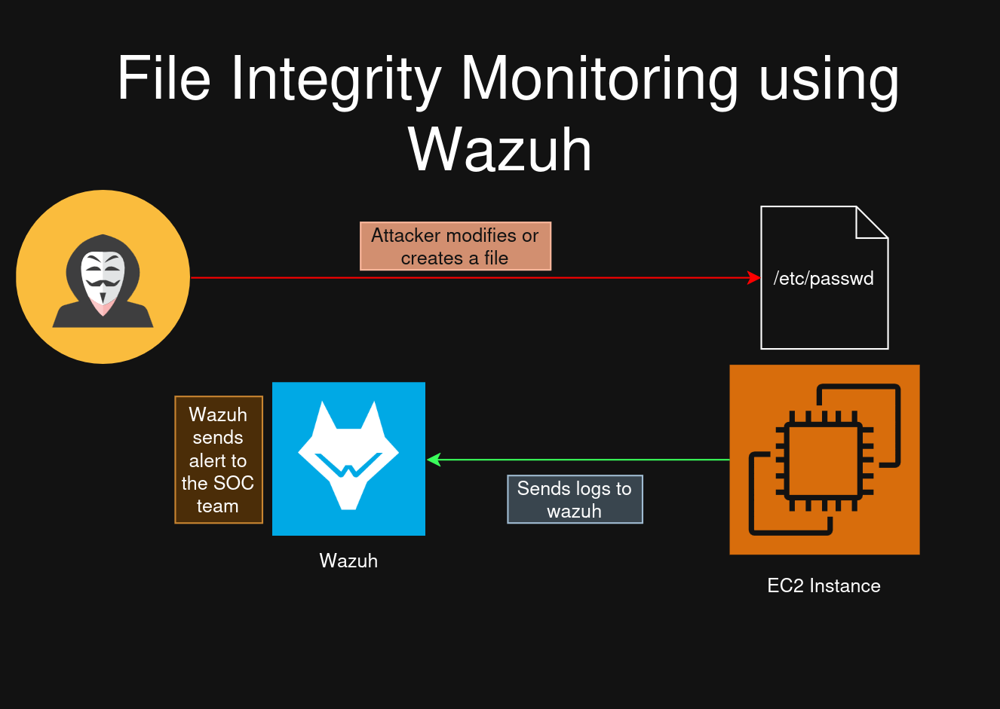

Building on our previous AWS CloudTrail integration, this project focuses on Wazuh's File Integrity Monitoring (FIM). We will deploy an Apache web server and configure Wazuh to monitor the uploads directory for any file creations, modifications, or deletions.

The project will be divided into 3 sections:

1. Creating a basic Apache web server
2. Deploying Wazuh agent on the Apache web server
3. Adding the uploads directory to the File Integrity Monitoring module for monitoring it

## Creating a basic Apache web server

Firstly, we will be launching an EC2 instance. We will be keeping it to `t3.micro` and the OS to be Amazon Linux 2023. The name of the EC2 instance will be `My Web Server` 

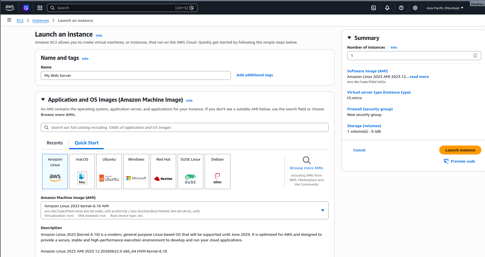

Now let's generate a new `SSH` key pair for logging in to the web server.

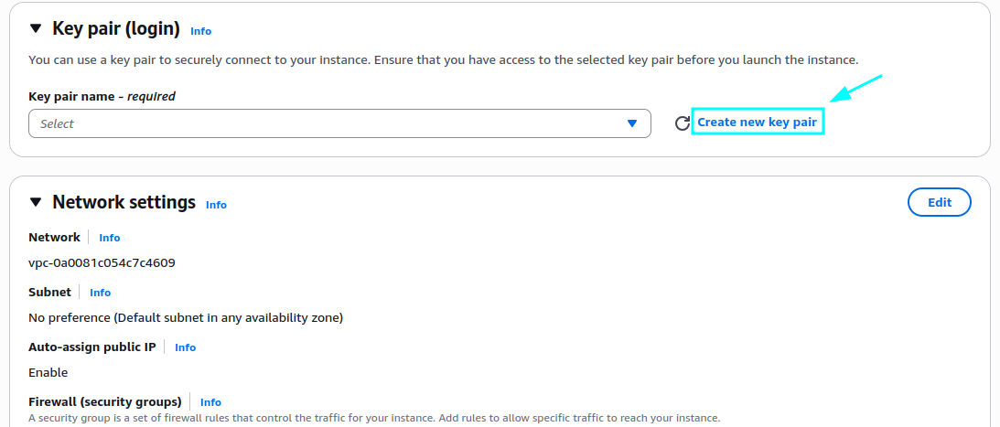

Let's use `ED25519` as it is much faster than `RSA`.

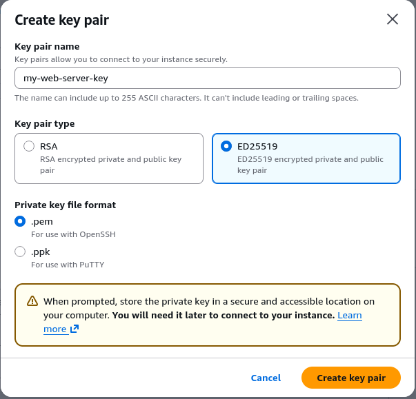

Allow HTTP access to access the Apache web server.

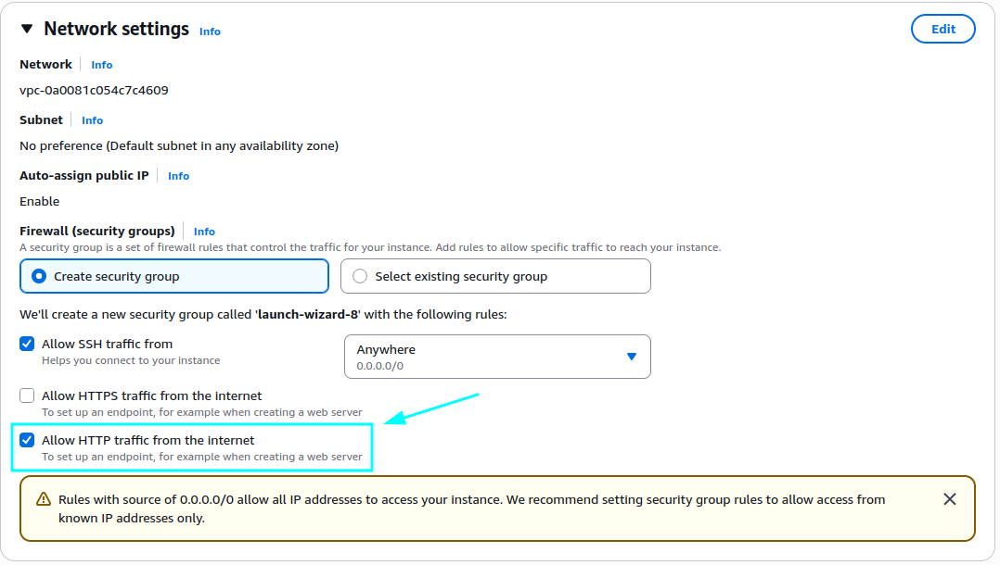

8 GB of storage is more than enough for the web server, it won't have a lot of data.

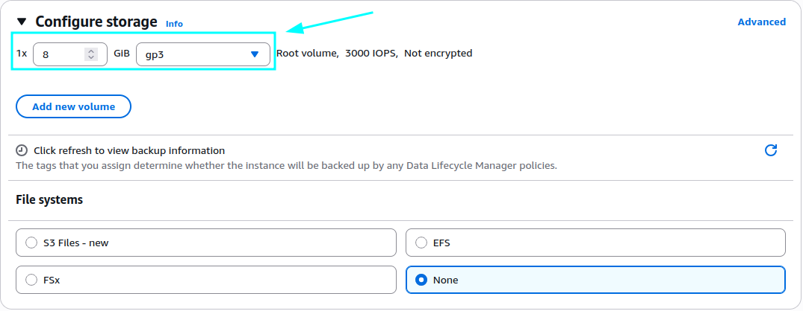

Let's login to the web server via `SSH` and install the Apache web server on it.

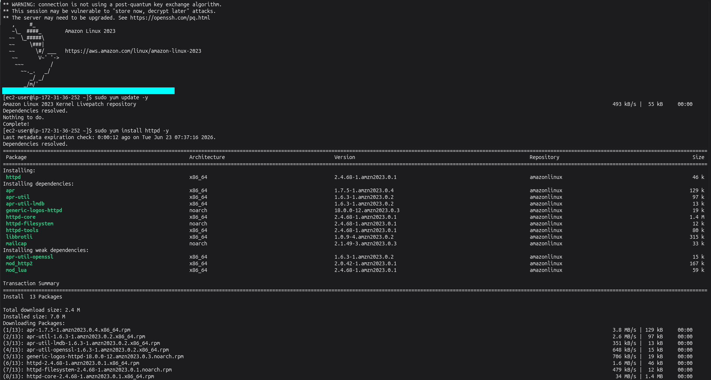

Now let's check if the Apache web server is installed and running.

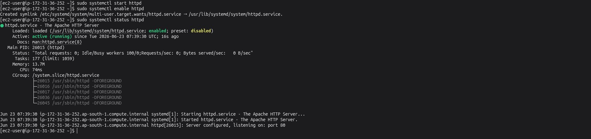

Yeah! the service is running, let's access the web server on a browser to see if it is working.

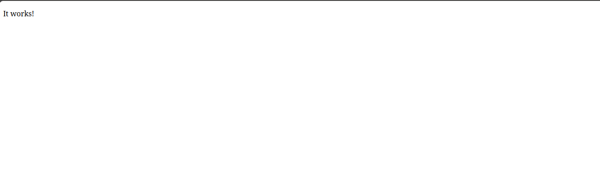

it works! now I'll just generate a basic file upload PHP script from Gemini and deploy it on the server, but before that we have to install PHP on the server so that it can actually run the script instead of just returning the source code.

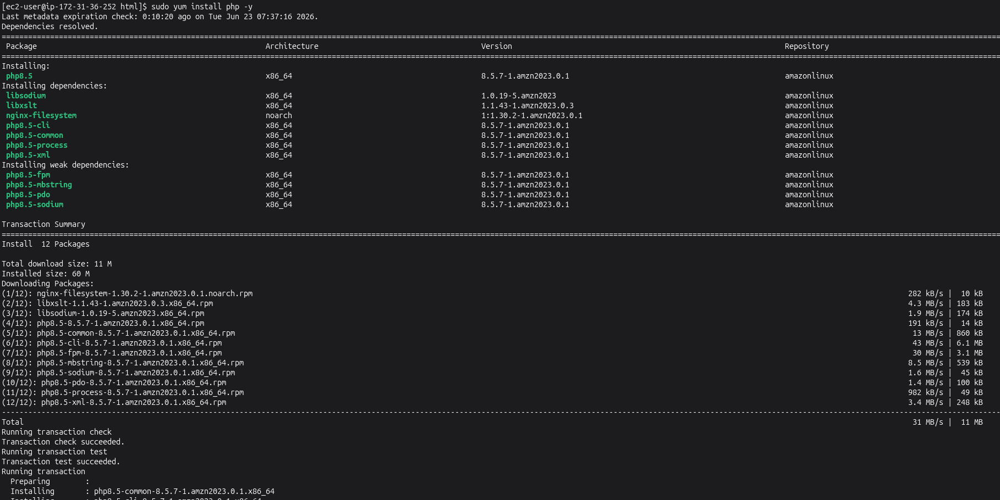

Now that we have installed PHP let's just restart the Apache service.

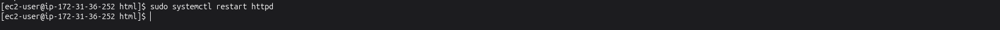

Now that we have restarted the Apache service let's put the PHP script in the `/var/www/html` directory, create the `/var/www/html/uploads` directory where the files will be uploaded it to and lastly change the owner of the `uploads` directory to the `apache` user and group so that the web server can actually write files to the directory. I forgot to screenshot it so I'll just write the commands.

```
sudo vim index.php # create the upload script
sudo mkdir uploads # create the uploads directory
sudo chown -R apache:apache uploads # change the owner to apache
```

**⚠️ Security Warning: This setup is intentionally vulnerable for the purpose of learning, please don't configure it like this in production.**

Now that we have created a simple web application to upload a file, let's try uploading something!

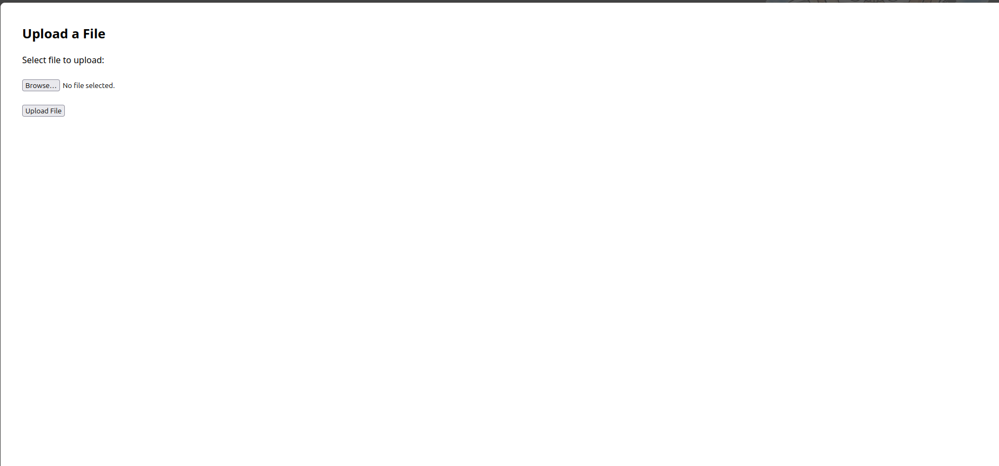

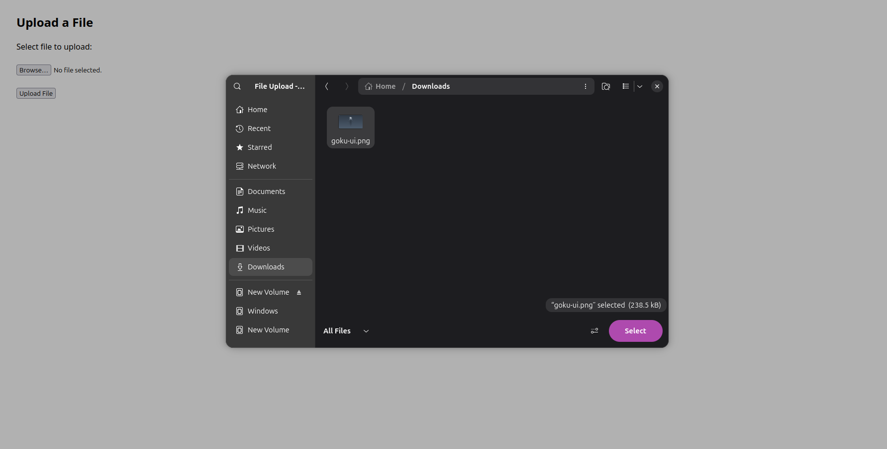

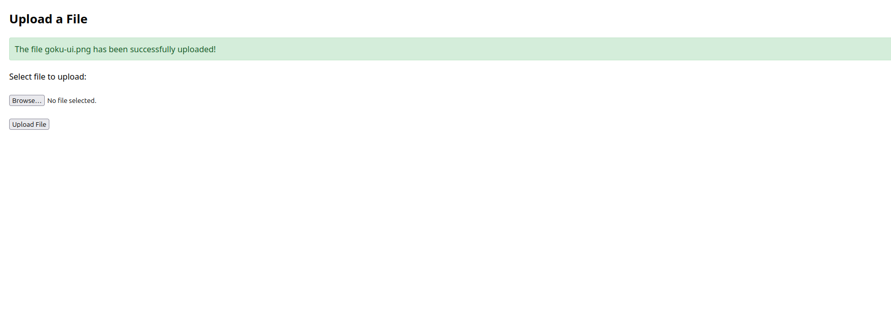

Now that we have uploaded the `goku-ui.png` image file, we can verify it by accessing the `/uploads` directory from the web server.

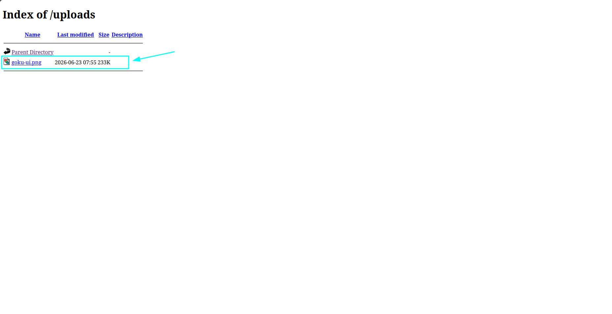

With that we have successfully created a basic web server hosting a file upload web application.
Now install the **Wazuh agent** on the server.

## Deploying Wazuh agent on the Apache web server

Deploying a Wazuh agent on the web server is super easy, we just have to copy and paste some commands from the dashboard.

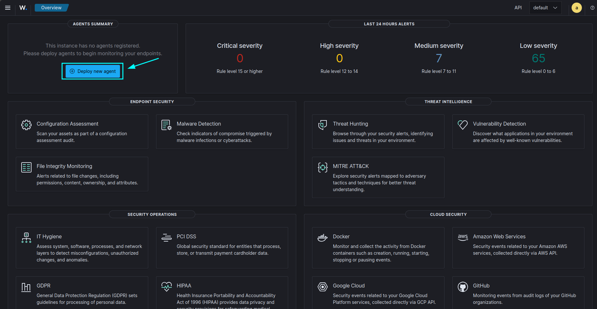

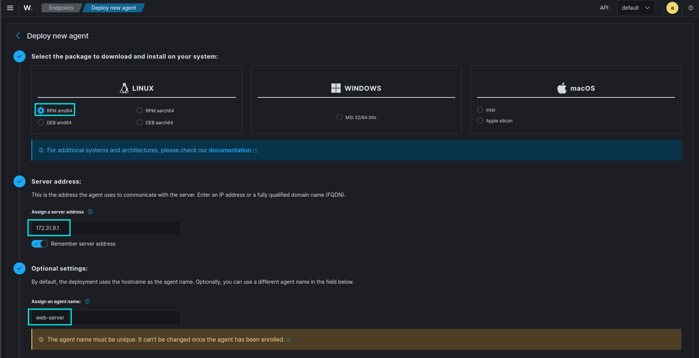

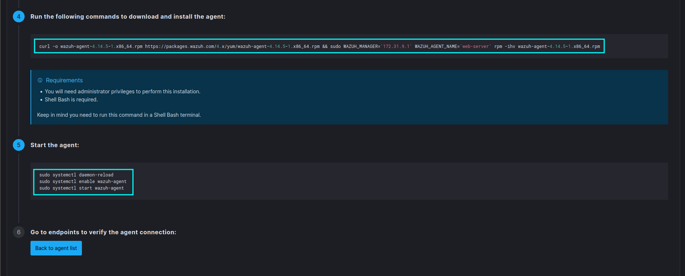

Now we just have to copy these commands in the terminal and run them.

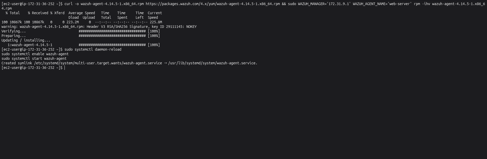

We have successfully installed the **Wazuh agent** on the server! But we are not done yet, we have to open ports `1515/TCP` and `1514/TCP` on the Wazuh server for the agent to be able to communicate with it.

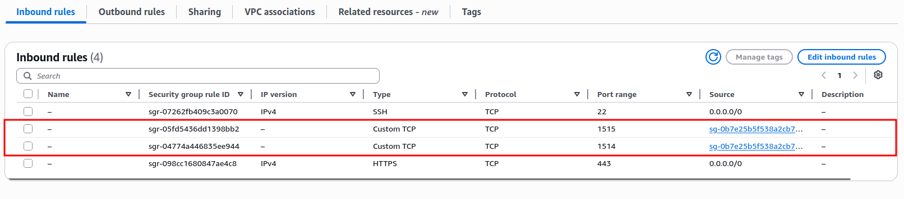

Let's open the Wazuh dashboard to see if the web server is registered as an agent on the Wazuh server.

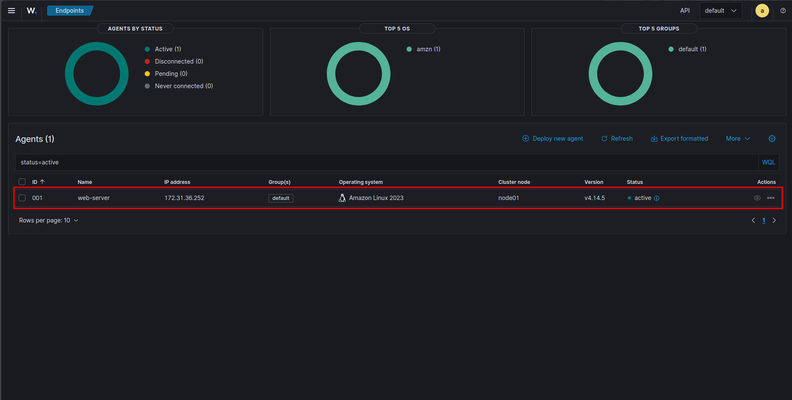

Yeah!! now the Wazuh agent is deployed successfully on the web server.

## Adding the uploads directory to the File Integrity Monitoring module for monitoring it

To add the `uploads` directory to the File Integrity Monitoring module for monitoring, we will have to add `<directories check_all="yes" report_changes="yes" realtime="yes">/var/www/html/uploads</directories>` in the `syscheck` field in the `/var/ossec/etc/ossec.conf` file which contains all the configurations for the agent.

```
<!-- File integrity monitoring -->
  <syscheck>
    <disabled>no</disabled>

    <!-- Frequency that syscheck is executed default every 12 hours -->
    <frequency>43200</frequency>

    <scan_on_start>yes</scan_on_start>

    <!-- Directories to check  (perform all possible verifications) -->
    <directories>/etc,/usr/bin,/usr/sbin</directories>
    <directories>/bin,/sbin,/boot</directories>
    <directories check_all="yes" report_changes="yes" realtime="yes">/var/www/html/uploads</directories>

    <!-- Files/directories to ignore -->
    <ignore>/etc/mtab</ignore>
    <ignore>/etc/hosts.deny</ignore>
    <ignore>/etc/mail/statistics</ignore>
    <ignore>/etc/random-seed</ignore>
    <ignore>/etc/random.seed</ignore>
    <ignore>/etc/adjtime</ignore>
    <ignore>/etc/httpd/logs</ignore>
    <ignore>/etc/utmpx</ignore>
    <ignore>/etc/wtmpx</ignore>
    <ignore>/etc/cups/certs</ignore>
    <ignore>/etc/dumpdates</ignore>
    <ignore>/etc/svc/volatile</ignore>

    <!-- File types to ignore -->
    <ignore type="sregex">.log$|.swp$</ignore>

    <!-- Check the file, but never compute the diff -->
    <nodiff>/etc/ssl/private.key</nodiff>

    <skip_nfs>yes</skip_nfs>
    <skip_dev>yes</skip_dev>
    <skip_proc>yes</skip_proc>
    <skip_sys>yes</skip_sys>

    <!-- Nice value for Syscheck process -->
    <process_priority>10</process_priority>

    <!-- Maximum output throughput -->
    <max_eps>50</max_eps>

    <!-- Database synchronization settings -->
    <synchronization>
      <enabled>yes</enabled>
      <interval>5m</interval>
      <max_eps>10</max_eps>
    </synchronization>
  </syscheck>
```

Now that we have added the directory name in the `ossec.conf` file, we will have to restart the `wazuh-agent` service to apply the changes. Just run this command:

```
sudo systemctl restart wazuh-agent
```

Let's see if Wazuh is monitoring the `uploads` directory now.

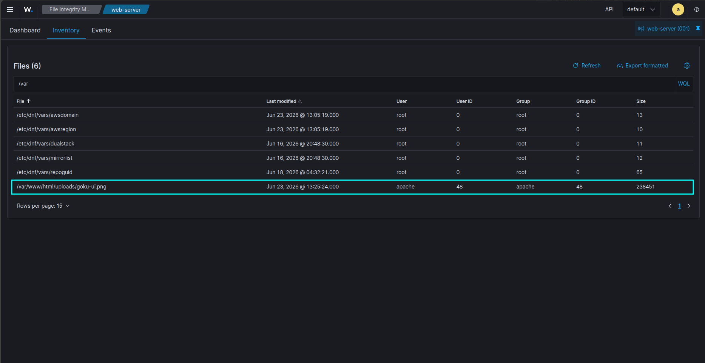

We can see that Wazuh is now actively monitoring the `uploads` folder, let's test it more by uploading some more files. For this example I have taken images of the Kanto starters bulbasaur, squirtle, and charmander.

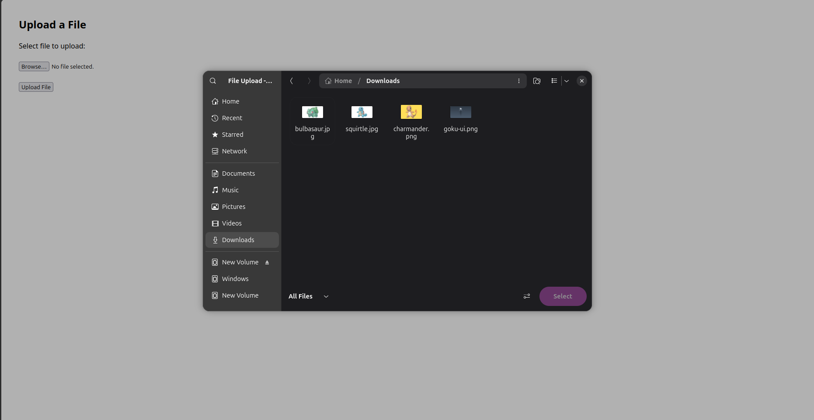

I have uploaded 3 images to the server which are `bulbasaur.jpg`, `squirtle.jpg`, and `charmander.png`. Let's see if Wazuh detected these changes to the `uploads` folder.

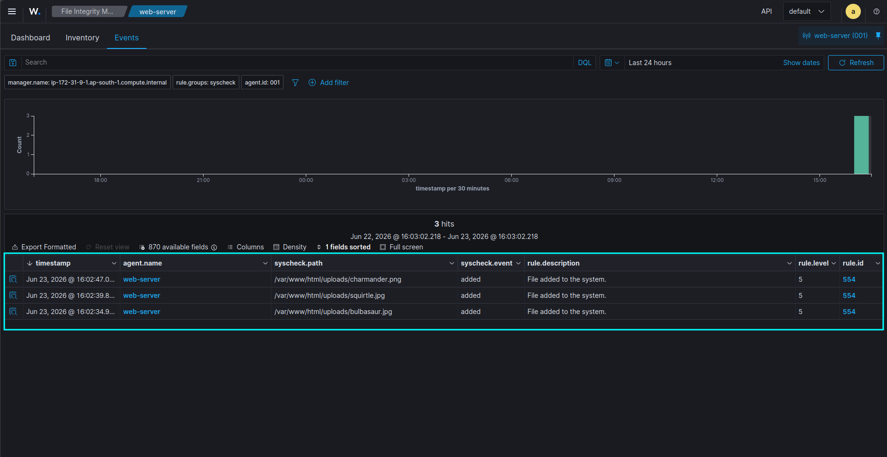

We can see in the `Events` tab that Wazuh has detected 3 new files in the `uploads` directory, but what if we upload the `charmander.png` file again? I haven't really added a filter to stop that so let's just see what happens.

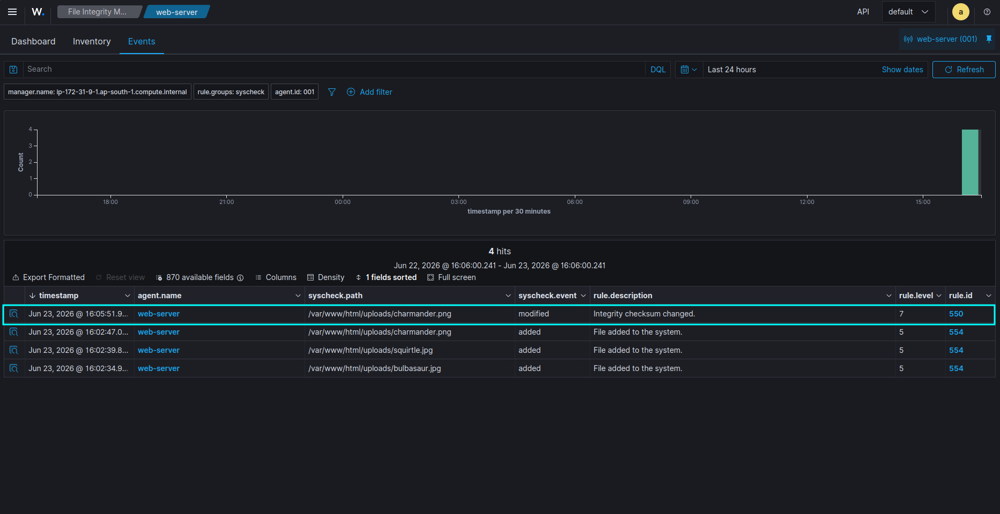

We can see that Wazuh has detected that the `charmander.png` file has been modified even though we have uploaded the same file, the file hash shouldn't change, then how did it detect it?  Even though most file integrity checks, including Wazuh, rely on a changed file hash to verify if a file has been modified, Wazuh also monitors native OS kernel events to see if a file is touched. Because of this, It was able to detect the modifications in the `charmander.png` file even though the hash didn't change.

# What's next?

Now that we have successfully set up File Integrity Monitoring for the `uploads` folder, we can integrate `VirusTotal` with Wazuh to scan the files which are uploaded to see if they are malicious or not. For example if someone uploads a reverse shell to the web server to gain initial access to it, we can detect it and by using **Wazuh's Active Response** module we can also remove it almost immediately! isn't that cool! We will be doing this for the next project.